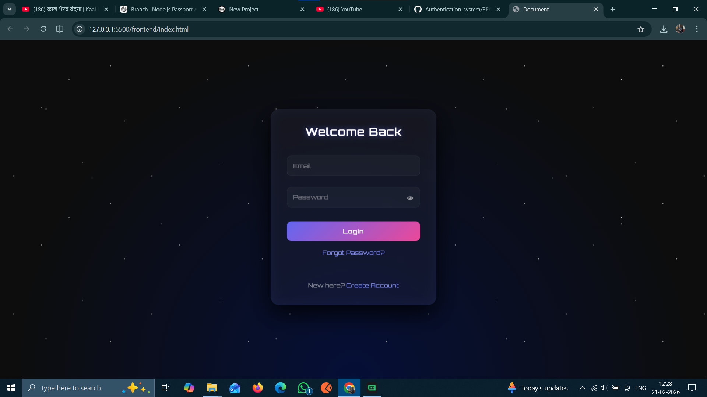
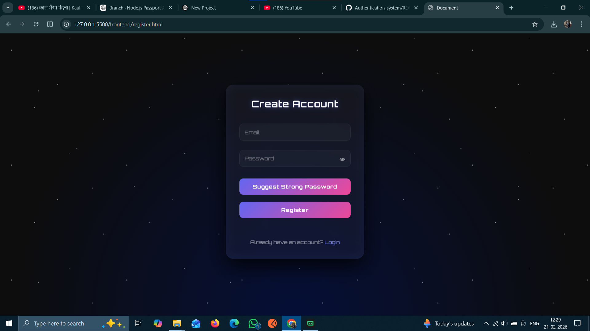
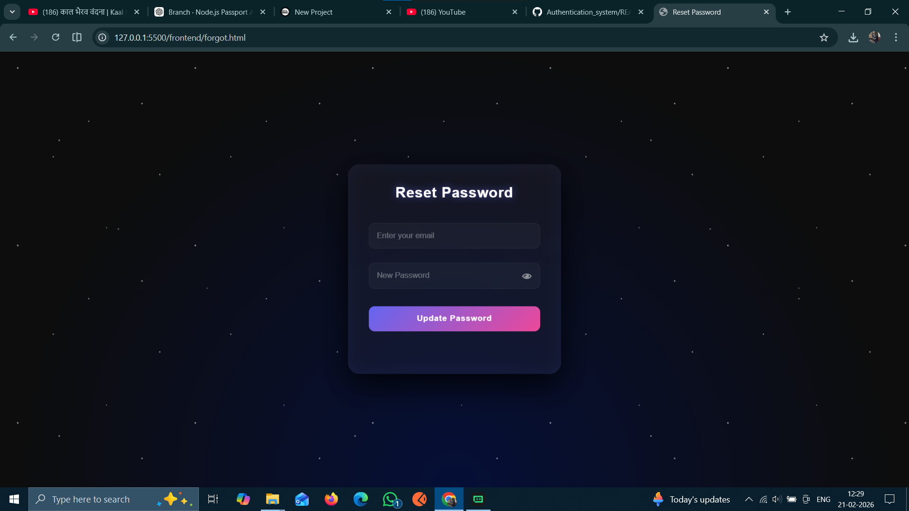

# 🚀 AUTHENTICATION SYSTEM

  

  
  
  
  
  

---

## 🌌 Project Vision

This project demonstrates a **production-style authentication flow** with a
futuristic cyberpunk-inspired interface.  
Designed not just to function — but to feel like a real SaaS product.

✨ Secure  
✨ Minimal  
✨ Futuristic  
✨ Interview-Ready  

---

## 🧠 Core Features

✅ User Registration  
✅ Secure Password Hashing (bcrypt)  
✅ Login Authentication  
✅ JWT-based Session Handling  
✅ Password Visibility Toggle  
✅ Strong Password Enforcement  
✅ Password Suggestion Generator  
✅ Simple Password Reset Flow  
✅ Protected Dashboard  
✅ Cyberpunk UI Theme  

---

## 🔐 Security Highlights

✔ Passwords stored using **bcrypt hashing**  
✔ No plain-text credentials  
✔ JWT-based authentication  
✔ Validation rules for strong passwords  
✔ Clean API separation  
✔ Brute-force protection ready  

---

## 🖥️ Interface Style

Inspired by:

- Cyberpunk UI systems
- Hacker console aesthetics
- Dark futuristic dashboards
- Neon glow & glassmorphism

---

## 📂 Project Structure

auth-system/
│
├── backend/
│ ├── server.js
│ ├── config/
│ ├── controllers/
│ ├── routes/
│ ├── middleware/
│ └── utils/
│
└── frontend/
├── index.html
├── register.html
├── forgot.html
├── dashboard.html
├── style.css
└── app.js

---
## 🖥️ Application Screens

### 🔐 Login Page

### 📝 Registration Page

### 🔁 Forgot Password

### 🚀 Dashboard

---

# ⚙️ USER MANUAL — COMPLETE GUIDE

---
## 0. Technical Stack

- **Backend**: Node.js, Express, Passport, JWT
- **Database**: MySQL
- **Frontend**: Vanilla HTML, CSS, JavaScript

## 🛠️ 1. Requirements

Ensure you have installed:

✔ Node.js  
✔ MySQL Server  
✔ Browser (Chrome recommended)

---

## 🧩 2. Database Setup

Open MySQL and run:

CREATE DATABASE auth_db;

USE auth_db;

CREATE TABLE users (
    id INT AUTO_INCREMENT PRIMARY KEY,
    email VARCHAR(255) UNIQUE,
    password VARCHAR(255),
    role VARCHAR(50) DEFAULT 'user'
);

## 🚀 3. Backend Setup

Navigate to backend folder:

cd backend
npm install
node server.js

Expected Output:

Server running on port 5000
## 🌐 4. Frontend Setup

Open directly in browser:

register.html → Create Account

index.html → Login

forgot.html → Reset Password

dashboard.html → User Panel

(No build tools required)

## 🔑 5. Registration Flow

1️⃣ Enter Email
2️⃣ Enter Strong Password
3️⃣ Optional → Click "Suggest Strong Password"
4️⃣ Click Register

✔ Duplicate email blocked
✔ Weak passwords rejected

## 🔓 6. Login Flow

1️⃣ Enter credentials
2️⃣ Click Login

✔ Valid → Dashboard opens
✔ Invalid → Error message

## 🔁 7. Password Reset Flow

1️⃣ Open forgot.html
2️⃣ Enter registered email
3️⃣ Enter new strong password
4️⃣ Click Update Password

✔ Password securely updated
✔ Auto redirect to login

## 🧭 8. Dashboard Behaviour

✔ Shows logged-in user
✔ Styled cyberpunk console
✔ Session termination option

## 🚪 9. Logout

Click Terminate Session / Logout

✔ Local session cleared
✔ Redirect to login

## 🎨 Design Philosophy

This project focuses on:

✔ Clean logic separation
✔ Secure handling of credentials
✔ Visual impact for portfolio use
✔ Realistic user flows

## 🧪 Testing Notes

For local testing:

✔ Backend must run on port 5000
✔ MySQL service active
✔ No CORS issues (enabled)

## 📌 Interview Talking Points

If presenting to interviewer:

✔ Password hashing using bcrypt
✔ JWT-based stateless auth
✔ Validation-driven UX
✔ Modular backend structure
✔ UI crafted without frameworks

## 💡 Possible Future Enhancements

🔹 Email Verification
🔹 OTP Reset Flow
🔹 Refresh Tokens
🔹 Role-Based Dashboards
🔹 Login Activity Logs
🔹 2FA Authentication

🧑‍💻 Author

Lihance Komesh Bopche
Full-Stack Developer • UI Enthusiast • System Designer
